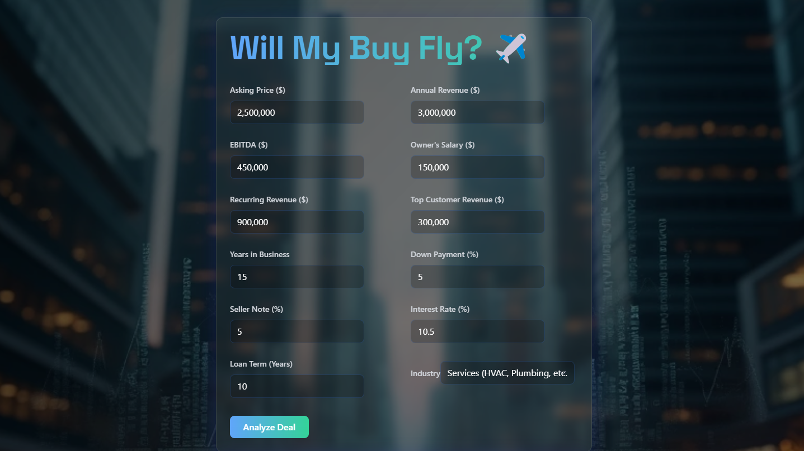
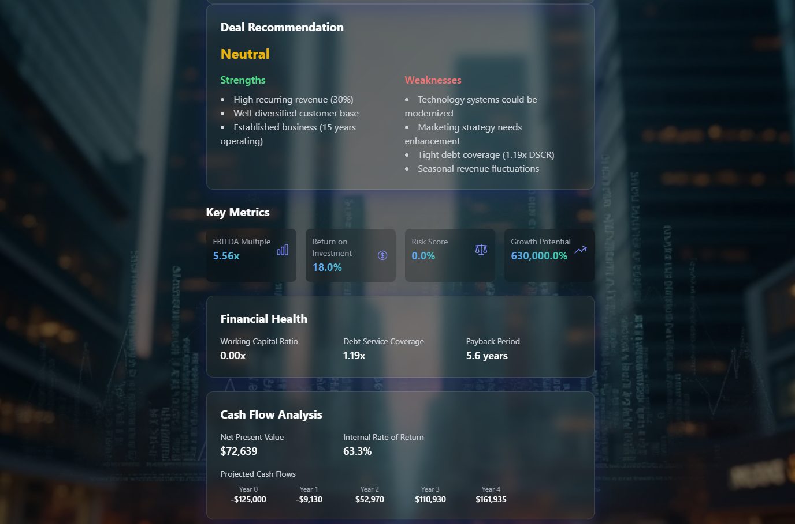

# Will My Buy Fly? ✈️ - Business Acquisition Analyzer

A sophisticated React-based tool designed to evaluate potential business acquisitions through advanced financial metrics and risk assessment. Built with modern web technologies and a beautiful glass morphism design.



## 🎯 Purpose

This tool helps entrepreneurs and business buyers make informed decisions by analyzing:
- SBA loan qualification and structuring
- Key financial metrics and ratios
- Risk assessment and growth potential
- SWOT analysis with industry-specific insights
- Cash flow projections and valuation metrics

## 🛠️ Technical Features

- **Framework**: React with TypeScript
- **Styling**: Tailwind CSS with Glass Morphism design
- **Form Management**: Formik with Yup validation
- **UI Components**: Heroicons
- **Deployment**: Netlify
- **Font**: Space Grotesk

## 📊 Financial Analysis Features



### Key Metrics
- EBITDA Multiple
- Revenue Multiple
- Return on Investment (ROI)
- Debt Service Coverage Ratio
- Payback Period
- Net Present Value (NPV)
- Internal Rate of Return (IRR)

### SBA Loan Structure
- Down Payment: 5% (SBA 7a minimum)
- Seller Note: 5%
- Bank Financing: 90%
- Interest Rate: Prime + 3.5%
- Loan Term: 10 years

## 🔍 Risk Assessment

The tool provides comprehensive risk analysis through:
- Industry-specific risk scoring
- Growth potential calculation
- Competitive threat assessment
- Customer concentration analysis
- Market position evaluation
- Recurring revenue analysis

## 🚀 Getting Started

1. Clone the repository:
```bash
git clone https://github.com/tony-42069/biz-acquisition.git
```

2. Install dependencies:
```bash
cd biz-acquisition
npm install
```

3. Start the development server:
```bash
npm start
```

## 🌐 Live Demo

Try it live: [Business Acquisition Analyzer](https://business-acquisition-analyzer.netlify.app/)

## 🔧 Sample Business Scenario

Test the analyzer with this sample case:
- HVAC Service Business
- $2.5M Asking Price
- $3M Annual Revenue
- $450K EBITDA
- 15 Years in Business
- 30% Recurring Revenue

## 🎨 Design Philosophy

The interface features:
- Modern glass morphism aesthetic
- Responsive design for all devices
- Dynamic gradient text elements
- Space Grotesk typography
- Intuitive form layout
- Clear data visualization

## 🔜 Future Enhancements

- Machine learning for risk prediction
- Real-time market data integration
- Industry benchmark comparisons
- PDF report generation
- Advanced visualization features
- More detailed industry-specific modules

## 📄 License

MIT License - feel free to use and modify for your needs!

## 🤝 Contributing

Contributions are welcome! Feel free to submit issues and pull requests.

---

Built with ❤️ by [Tony Sader](https://github.com/tony-42069)
